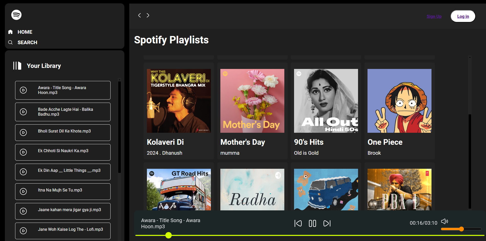
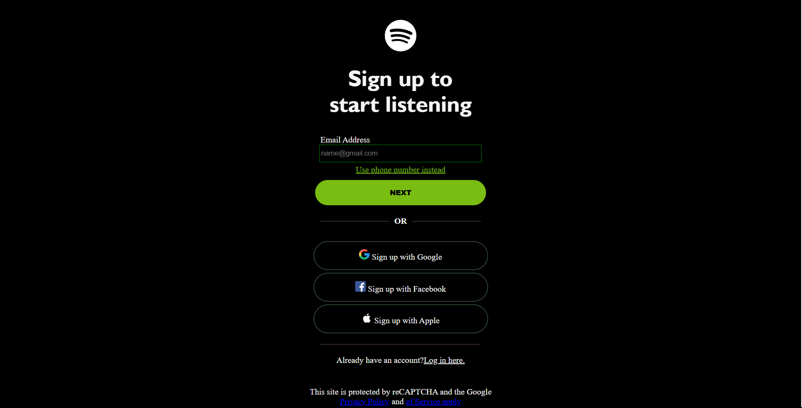

# Spotify -Music - Web Music Player

A simple web-based Spotify clone built with vanilla JavaScript, HTML, and CSS. This project fetches songs from local folders and allows users to play, pause, seek, control volume, and browse music albums just like in a basic music streaming app.


##  Features

-  Play/pause songs
-  Previous/next track
-  Load songs from multiple folders (albums)
-  Display current and total duration of the track
-  Interactive seekbar
-  Volume control and mute toggle
-  Responsive UI with album cover art
-  Hamburger menu for navigation
  
---

## Screenshots


 
---
## Folder Structure
```plaintext
project-root/
├── index.html
├── style.css
├── script.js
├── img/
│ ├── play.svg
│ ├── pause.svg
│ ├── mute.svg
│ ├── volume.svg
├── songs/
│ ├── album1/
│ │ ├── song1.mp3
│ │ ├── song2.mp3
│ │ ├── cover.jpg
│ │ └── info.json
│ ├── album2/
│ │ ├── song1.mp3
│ │ ├── cover.jpg
│ │ └── info.json
│ └── ...
└── albums.json
```

## Setup & Installation
1. Clone the repository:
- git clone https://github.com/your-username/spotify-clone.git  
- cd spotify-clone   
2. Add your songs and metadata.        
3. Update albums.json   
4. Open index.html in your browser.     

## License
This project is licensed under the [MIT License](https://opensource.org/licenses/MIT).
